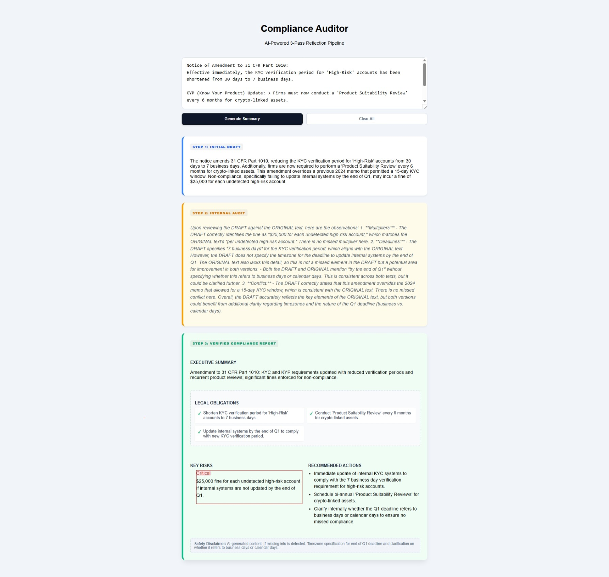
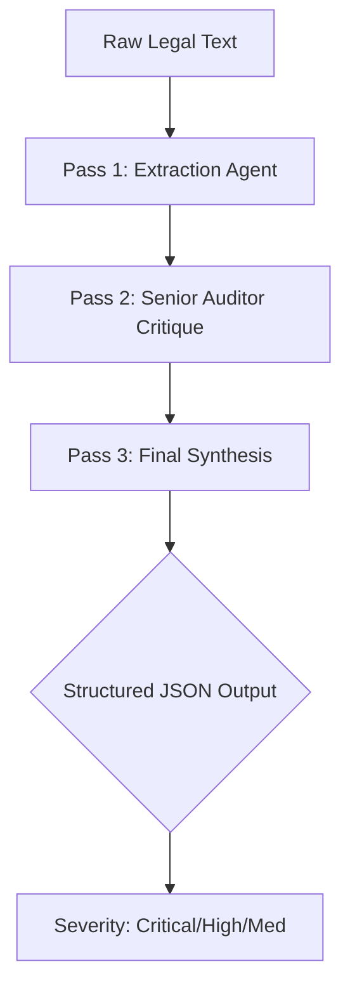

Compliance Auditor: AI-Powered 3-Pass Reflection Pipeline



A high-precision FinTech tool designed to extract regulatory obligations and risk multipliers from dense legal documents. Unlike standard summarizers, this tool uses an Agentic Reflection Architecture to ensure no financial penalties (like "per account" or "per day" fines) are missed.

🚀 The Problem: Why Compliance Auditor?

| The Problem | The Solution |
| :--- | :--- |
| **Complex Regulatory Jargon:** Critical changes are often buried in dense, 50-page legal notices. | **Automated Extraction:** Instantly parses raw text to isolate core obligations and deadlines. |
| **High Financial Risk:** Missing a "per account" multiplier can lead to catastrophic company losses. | **Financial Triage:** Specifically flags "Critical" severity penalties and recurrent liability. |
| **AI Summarization Errors:** Standard LLMs often hallucinate or miss subtle conflicts between new and old rules. | **3-Pass Reflection Pipeline:** Uses an internal "Self-Audit" pass to catch missed details or hallucinations. |
| **Ambiguous Deadlines:** Notices often mention "End of Q1" without specifying timezones. | **Precision Gap Detection:** Pass 2 flags ambiguous terms, recommending points for human clarification. |
| **Manual Auditing Fatigue:** Legal teams spend hours cross-referencing, leading to human error. | **Verified Compliance Reports:** Generates structured Executive Summaries with actionable checkboxes. |

🧠 The Solution: 3-Pass Reflection Logic
This project implements a three-stage cognitive pipeline:



**Pass 1:** Extraction (GPT-4o-mini) - Rapidly drafts initial compliance points with a "Scope Guard" to reject non-regulatory content.

**Pass 2:** Audit (GPT-4o) - A "Senior Auditor" agent compares the draft against the original source to find missed multipliers, deadlines, or rule overrides.

**Pass 3:** Synthesis (GPT-4o + Structured Outputs) - Combines the draft and critique into a final, high-precision JSON report with automated Severity Scoring (Critical, High, Medium, Low).

**Real-World Example Output**
When processing a complex notice regarding 31 CFR Part 1010, the pipeline generates this structured response:

```json
{
  "summary": "The notice amends 31 CFR Part 1010, enforcing a reduced KYC verification window.",
  "key_risks": [
    {
      "description": "Failure to update systems by Q1 results in a $25,000 fine per account.",
      "severity": "CRITICAL"
    }
  ],
  "obligations": [
    "Shorten KYC verification period to 7 business days.",
    "Conduct monthly Product Suitability Reviews."
  ],
  "missing_info": "The notice does not specify the timezone for the Q1 deadline."
}
```
🛠️ **Tech Stack**
**Frontend:** React, TypeScript, CSS3 (Animations & Flexbox)

**Backend:** FastAPI, Python, Pydantic (Structured Data Validation)

**AI:** OpenAI GPT-4o API, Beta Chat Completions Parse (for strict JSON schema adherence)

**Tools:** Axios, Dotenv

✨ **Key Features**
**Agentic Critique:** The AI self-corrects before showing the user the final result.

**Severity Pulse:** Visual "Critical" alerts for high-impact financial risks using CSS keyframes.

**Safety Disclaimer:** Built-in transparency regarding missing information to ensure a "Human-in-the-Loop" workflow.


## ⚙️ Setup & Installation

### 1. Prerequisites
* Python 3.9+
* Node.js 16+
* OpenAI API Key

### 2. Backend Setup (FastAPI)
The backend handles the AI logic and runs on **Port 8000**.

```bash
cd server
python -m venv venv
source venv/bin/activate  # Windows: venv\Scripts\activate
pip install -r requirements.txt
Create a .env file in the /server folder:
OPENAI_API_KEY=your_key_here
Run the Backend:
uvicorn main:app --reload --port 8000
```

### 3. Frontend Setup (React)
The frontend provides the dashboard and runs on Port 3000.

```
cd client
npm install
npm start
```
